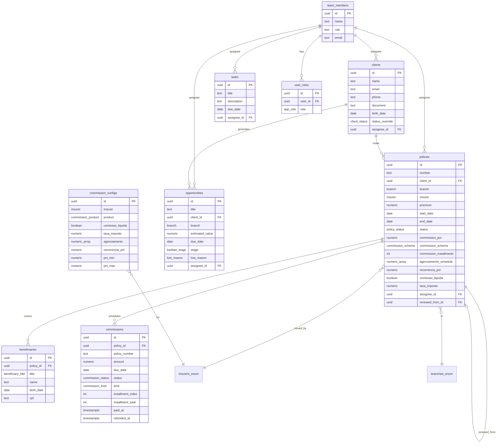

# TheInsuranceOS — Database Schema & Business Rules

> **Single Source of Truth** para o produto e para a IA. Este documento tem duas partes:
>
> - **Parte 1 — Guia de Regras de Negócio** — para humanos: como o software se comporta.
> - **Parte 2 — Dicionário Técnico Prompt-Ready** — copie/cole no início de novos chats de IA para dar contexto imediato.

---

## Índice

- [Parte 1 — Guia de Regras de Negócio](#parte-1--guia-de-regras-de-negócio)
  - [1.1 Domínio & Glossário](#11-domínio--glossário)
  - [1.2 Fluxo de Vendas e Emissão de Apólices](#12-fluxo-de-vendas-e-emissão-de-apólices)
  - [1.3 A Regra de Ouro da Comissão](#13-a-regra-de-ouro-da-comissão)
  - [1.4 O Motor de Comissões (`commissionEngine`)](#14-o-motor-de-comissões-commissionengine)
  - [1.5 O Módulo Diário (Daily)](#15-o-módulo-diário-daily)
- [Parte 2 — Dicionário Técnico Prompt-Ready](#parte-2--dicionário-técnico-prompt-ready)
  - [2.1 ERD](#21-erd)
  - [2.2 Schema SQL (Supabase / PostgreSQL)](#22-schema-sql-supabase--postgresql)
  - [2.3 Mapeamento TypeScript ↔ Postgres](#23-mapeamento-typescript--postgres)
  - [2.4 Políticas RLS](#24-políticas-rls)
  - [2.5 Variáveis de Ambiente](#25-variáveis-de-ambiente)

---

# Parte 1 — Guia de Regras de Negócio

## 1.1 Domínio & Glossário

| Termo | Definição |
| --- | --- |
| **Corretor / Team Member** | Usuário autenticado da plataforma. Pertence a uma corretora e é responsável (`assignee`) por clientes, apólices e tarefas. |
| **Cliente** | Pessoa física (titular). Tem CPF, contato, data de nascimento e status (`ativo`, `inativo`, `lead`). |
| **Ramo (`Branch`)** | Segmento de seguro: `Auto`, `Vida`, `Residencial`, `Empresarial`, `Saúde`, `Consórcio`. |
| **Seguradora (`Insurer`)** | `Porto Seguro`, `Bradesco`, `SulAmérica`, `Allianz`, `Mapfre`. |
| **Apólice** | Contrato emitido para um cliente em um ramo/seguradora, com prêmio, vigência e configuração de comissionamento própria. |
| **Beneficiário** | Dependente vinculado a uma apólice (Saúde/Vida): titular, cônjuge, filho, etc. |
| **Comissão** | Parcela financeira devida ao corretor pela apólice. Tem status (`pago`, `pendente`, `atrasado`, `devolvido`, `cancelada`). |
| **Oportunidade / Pipeline** | Card do kanban de vendas: `lead → cotacao → negociacao → fechado | perdido`. |

## 1.2 Fluxo de Vendas e Emissão de Apólices

```text
Cliente/Lead → Oportunidade (Kanban) → Cotação (Multicalc) → Fechamento → Apólice → Cronograma de Comissões
```

1. **Captação** — Um `Client` é criado (manualmente ou vindo de um formulário). Vira uma `Opportunity` no estágio `lead`.
2. **Cotação (Multicalc)** — Corretor gera cotações (`Quote`) por seguradora para o mesmo `quoteGroupId`. A oportunidade avança para `cotacao` e depois `negociacao`.
3. **Fechamento** — Ao ganhar, a oportunidade vai para `fechado` e uma `Policy` é emitida com:
   - `number`, `branch`, `insurer`, `premium`, `startDate`, `endDate`
   - `assigneeId` = corretor responsável
   - **configuração de comissionamento congelada no momento do fechamento** (ver §1.3)
4. **Geração automática de comissões** — `commissionStore.generateForPolicy(policy)` chama o `commissionEngine` e insere N parcelas de `Commission` associadas à `policyId`.
5. **Estados da apólice** — `ativa | vencida | pendente | cancelada | renovada`. Renovação copia a apólice e vincula `renewedFromId ↔ renewedToId`.
6. **Cascata de cancelamento** — Quando uma apólice passa a `cancelada`, o `commissionStore` reage:
   - Comissões `pago` → **`devolvido`** (com `refundedAt` e `refundReason`).
   - Comissões `pendente` ou `atrasado` → **`cancelada`**.
   - Comissões `devolvido`/`cancelada` permanecem.

## 1.3 A Regra de Ouro da Comissão

> **Cada apólice deve conter e registrar a sua própria porcentagem e configuração de comissão.**
>
> Taxas de comissão **não são estáticas**: variam por contrato, seguradora e ramo, e são definidas pelo corretor no fechamento daquele serviço. O valor negociado é **congelado na apólice** e nunca deve ser recalculado retroativamente a partir do config global da seguradora.

Campos que a apólice armazena explicitamente (todos overrides do default da seguradora):

| Campo | Uso |
| --- | --- |
| `commissionPct` | Percentual sobre o prêmio (Auto/Vida/Res/Emp e Consórcio). |
| `commissionScheme` | `agenciamento`, `esgotamento`, `parcela`, `unica`, `vitalicio`. |
| `commissionInstallments` | Nº de parcelas quando `scheme = parcela`. |
| `agenciamentoSchedule` | Vetor de multiplicadores mensais para Saúde (ex.: `[1.0, 0.5, 0.3, 0.2]`). |
| `recorrenciaPct` | Percentual mensal de recorrência após o agenciamento (Saúde). |
| `comissaoLiquida` | Se `true`, aplica dedução fiscal ao valor. |
| `taxaImposto` | Alíquota fiscal usada quando `comissaoLiquida = true` (default 11,5%). |

O `commissionConfigStore` fornece **defaults por seguradora + produto** — usados **apenas** como sugestão ao emitir uma apólice nova. Uma vez salvos na apólice, tornam-se a verdade.

## 1.4 O Motor de Comissões (`commissionEngine`)

Função pura em `src/lib/financial/commissionEngine.ts`. Recebe `Policy + CommissionConfig` e devolve `Commission[]`.

**Mapeamento `branch → product`:**

| Ramo | Produto |
| --- | --- |
| Saúde | `saude` |
| Consórcio | `consorcio` |
| Auto, Vida, Residencial, Empresarial | `auto` |

**Esquemas por produto:**

| Produto | Scheme | Regra de geração |
| --- | --- | --- |
| Saúde | `agenciamento` | Para cada `i` em `agenciamentoSchedule`: parcela `amount = mensalidade × schedule[i]`, `dueDate = startDate + i meses`, `kind = agenciamento`. |
| Saúde | `vitalicio` | Sem parcelas fixas. Só recorrência a partir da parcela `vitalicioStartInstallment` (default 13). |
| Saúde | (recorrência mensal) | Gerada mês a mês por `expectedRecurrencesUntil` até o mês corrente. `amount = mensalidade × recorrenciaPct`, `kind = recorrencia` ou `vitalicio`. |
| Consórcio | `unica` | 1 parcela: `amount = premium × (commissionPct / 100)`, vencimento `startDate + 30 dias`. |
| Auto/Vida/Res/Emp | `esgotamento` | 1 parcela única: `amount = premium × commissionPct`, vencimento `startDate + 30 dias`. |
| Auto/Vida/Res/Emp | `parcela` | N parcelas iguais: `amount = (premium × commissionPct) / N`, mensais. |

**Impostos (comissão líquida):**

```text
if comissaoLiquida:
    amount_final = amount × (1 - taxaImposto)     // ex.: 1000 × (1 - 0.115) = 885,00
else:
    amount_final = amount
```

`taxaImposto` default: `0.115` (11,5%). Sempre arredondado a 2 casas.

**Apólices `cancelada` ou `vencida` não geram cronograma** — a função retorna `[]`.

## 1.5 O Módulo Diário (Daily)

### Menções `@usuario` / `@todos`

- Regex: `/@([A-Za-zÀ-ÿ]+(?:\s+[A-Za-zÀ-ÿ]+)*)/g` — suporta acentos e nomes compostos.
- Match **guloso**: dado `@Ana Maria Souza`, tenta 3, 2, 1 palavras e escolhe o maior prefixo que existe no `TeamNameIndex` (mapa `nome.toLowerCase() → userId`).
- `@todos` é palavra reservada — broadcast para todo o time.
- `textMentionsUser(text, userId, index, cache?)` aceita cache para O(1) em listas grandes.

### Alertas Inteligentes

- **Renovação** — apólices com `endDate` dentro da janela configurada (ex.: 30/60/90 dias) aparecem como alerta.
- **Faixa etária (Saúde)** — beneficiários que cruzam uma banda de idade (`ageBands`) no mês corrente disparam alerta de reajuste.
- **SLA** — tarefas cujo `dueDate` está próximo ou vencido são realçadas por `relativeDueLabel` (`Hoje`, `Amanhã`, `Em Nd`, `Atrasada Nd`).

---

# Parte 2 — Dicionário Técnico Prompt-Ready

> 📋 **Copie a partir daqui em novos chats de IA.** Esta seção é auto-contida.

**Stack:** TanStack Start v1 · React 19 · TypeScript strict · Tailwind v4 · Supabase (PostgreSQL 15 + RLS) · Lovable Cloud.

## 2.1 ERD



## 2.2 Schema SQL (Supabase / PostgreSQL)

### Enums

```sql
CREATE TYPE public.app_role            AS ENUM ('admin', 'manager', 'broker');
CREATE TYPE public.policy_status       AS ENUM ('ativa','vencida','pendente','cancelada','renovada');
CREATE TYPE public.client_status       AS ENUM ('ativo','inativo','lead');
CREATE TYPE public.branch              AS ENUM ('Auto','Vida','Residencial','Empresarial','Saúde','Consórcio');
CREATE TYPE public.insurer             AS ENUM ('Porto Seguro','Bradesco','SulAmérica','Allianz','Mapfre');
CREATE TYPE public.commission_scheme   AS ENUM ('agenciamento','esgotamento','parcela','unica','vitalicio');
CREATE TYPE public.commission_kind     AS ENUM ('agenciamento','recorrencia','esgotamento','parcela','unica','vitalicio');
CREATE TYPE public.commission_status   AS ENUM ('pago','pendente','atrasado','devolvido','cancelada');
CREATE TYPE public.commission_product  AS ENUM ('saude','auto','consorcio');
CREATE TYPE public.kanban_stage        AS ENUM ('lead','cotacao','negociacao','fechado','perdido');
CREATE TYPE public.lost_reason         AS ENUM ('preco','cobertura','prazo','sem-retorno','outro');
CREATE TYPE public.beneficiary_title   AS ENUM ('titular','conjuge','filho','pai_mae','irmao','parente','outro');
```

### Trigger padrão `updated_at`

```sql
CREATE OR REPLACE FUNCTION public.set_updated_at()
RETURNS trigger LANGUAGE plpgsql AS $$
BEGIN
  NEW.updated_at = now();
  RETURN NEW;
END;
$$;
```

### `team_members`

```sql
CREATE TABLE public.team_members (
  id          UUID PRIMARY KEY REFERENCES auth.users(id) ON DELETE CASCADE,
  name        TEXT NOT NULL,
  role        TEXT NOT NULL,
  email       TEXT NOT NULL UNIQUE,
  created_at  TIMESTAMPTZ NOT NULL DEFAULT now(),
  updated_at  TIMESTAMPTZ NOT NULL DEFAULT now()
);
GRANT SELECT, INSERT, UPDATE, DELETE ON public.team_members TO authenticated;
GRANT ALL ON public.team_members TO service_role;
ALTER TABLE public.team_members ENABLE ROW LEVEL SECURITY;
CREATE TRIGGER trg_team_members_updated BEFORE UPDATE ON public.team_members
  FOR EACH ROW EXECUTE FUNCTION public.set_updated_at();
```

### `user_roles` + `has_role`

```sql
CREATE TABLE public.user_roles (
  id       UUID PRIMARY KEY DEFAULT gen_random_uuid(),
  user_id  UUID NOT NULL REFERENCES auth.users(id) ON DELETE CASCADE,
  role     public.app_role NOT NULL,
  UNIQUE (user_id, role)
);
GRANT SELECT ON public.user_roles TO authenticated;
GRANT ALL ON public.user_roles TO service_role;
ALTER TABLE public.user_roles ENABLE ROW LEVEL SECURITY;

CREATE OR REPLACE FUNCTION public.has_role(_user_id UUID, _role public.app_role)
RETURNS BOOLEAN
LANGUAGE sql STABLE SECURITY DEFINER SET search_path = public
AS $$
  SELECT EXISTS (
    SELECT 1 FROM public.user_roles WHERE user_id = _user_id AND role = _role
  )
$$;
```

### `clients`

```sql
CREATE TABLE public.clients (
  id               UUID PRIMARY KEY DEFAULT gen_random_uuid(),
  name             TEXT NOT NULL,
  email            TEXT NOT NULL,
  phone            TEXT NOT NULL,
  document         TEXT NOT NULL,
  birth_date       DATE,
  status_override  public.client_status,
  assignee_id      UUID NOT NULL REFERENCES public.team_members(id),
  created_at       TIMESTAMPTZ NOT NULL DEFAULT now(),
  updated_at       TIMESTAMPTZ NOT NULL DEFAULT now()
);
CREATE INDEX idx_clients_assignee ON public.clients(assignee_id);
CREATE INDEX idx_clients_document ON public.clients(document);
GRANT SELECT, INSERT, UPDATE, DELETE ON public.clients TO authenticated;
GRANT ALL ON public.clients TO service_role;
ALTER TABLE public.clients ENABLE ROW LEVEL SECURITY;
CREATE TRIGGER trg_clients_updated BEFORE UPDATE ON public.clients
  FOR EACH ROW EXECUTE FUNCTION public.set_updated_at();
```

### `policies`

```sql
CREATE TABLE public.policies (
  id                       UUID PRIMARY KEY DEFAULT gen_random_uuid(),
  number                   TEXT NOT NULL UNIQUE,
  client_id                UUID NOT NULL REFERENCES public.clients(id) ON DELETE RESTRICT,
  branch                   public.branch  NOT NULL,
  insurer                  public.insurer NOT NULL,
  premium                  NUMERIC(14,2) NOT NULL CHECK (premium >= 0),
  start_date               DATE NOT NULL,
  end_date                 DATE,
  status                   public.policy_status NOT NULL DEFAULT 'ativa',
  renewed_from_id          UUID REFERENCES public.policies(id) ON DELETE SET NULL,
  renewed_to_id            UUID REFERENCES public.policies(id) ON DELETE SET NULL,

  -- Comissionamento (congelado no fechamento)
  commission_pct           NUMERIC(6,4),                 -- ex.: 0.1800 = 18%
  commission_scheme        public.commission_scheme,
  commission_installments  INT CHECK (commission_installments > 0),
  agenciamento_schedule    NUMERIC(6,4)[],               -- ex.: {1.0000,0.5000,0.3000,0.2000}
  recorrencia_pct          NUMERIC(6,4),
  comissao_liquida         BOOLEAN NOT NULL DEFAULT false,
  taxa_imposto             NUMERIC(6,4) NOT NULL DEFAULT 0.1150,

  -- Saúde
  health_anniversary       DATE,
  health_initial_value     NUMERIC(14,2),
  health_category          TEXT,
  health_coparticipation   BOOLEAN,

  -- Consórcio
  consortium_group         TEXT,
  consortium_quota         TEXT,
  consortium_type          TEXT CHECK (consortium_type IN ('Imóvel','Auto')),

  assignee_id              UUID NOT NULL REFERENCES public.team_members(id),
  created_at               TIMESTAMPTZ NOT NULL DEFAULT now(),
  updated_at               TIMESTAMPTZ NOT NULL DEFAULT now()
);
CREATE INDEX idx_policies_client   ON public.policies(client_id);
CREATE INDEX idx_policies_assignee ON public.policies(assignee_id);
CREATE INDEX idx_policies_status   ON public.policies(status);
CREATE INDEX idx_policies_end_date ON public.policies(end_date);
GRANT SELECT, INSERT, UPDATE, DELETE ON public.policies TO authenticated;
GRANT ALL ON public.policies TO service_role;
ALTER TABLE public.policies ENABLE ROW LEVEL SECURITY;
CREATE TRIGGER trg_policies_updated BEFORE UPDATE ON public.policies
  FOR EACH ROW EXECUTE FUNCTION public.set_updated_at();
```

### `beneficiaries`

```sql
CREATE TABLE public.beneficiaries (
  id            UUID PRIMARY KEY DEFAULT gen_random_uuid(),
  policy_id     UUID NOT NULL REFERENCES public.policies(id) ON DELETE CASCADE,
  title         public.beneficiary_title NOT NULL,
  title_custom  TEXT,
  name          TEXT NOT NULL,
  birth_date    DATE NOT NULL,
  cpf           TEXT NOT NULL,
  created_at    TIMESTAMPTZ NOT NULL DEFAULT now(),
  updated_at    TIMESTAMPTZ NOT NULL DEFAULT now()
);
CREATE INDEX idx_beneficiaries_policy ON public.beneficiaries(policy_id);
GRANT SELECT, INSERT, UPDATE, DELETE ON public.beneficiaries TO authenticated;
GRANT ALL ON public.beneficiaries TO service_role;
ALTER TABLE public.beneficiaries ENABLE ROW LEVEL SECURITY;
CREATE TRIGGER trg_beneficiaries_updated BEFORE UPDATE ON public.beneficiaries
  FOR EACH ROW EXECUTE FUNCTION public.set_updated_at();
```

### `commissions`

```sql
CREATE TABLE public.commissions (
  id                  UUID PRIMARY KEY DEFAULT gen_random_uuid(),
  policy_id           UUID NOT NULL REFERENCES public.policies(id) ON DELETE CASCADE,
  policy_number       TEXT NOT NULL,
  client_name         TEXT NOT NULL,
  insurer             public.insurer NOT NULL,
  amount              NUMERIC(14,2) NOT NULL CHECK (amount >= 0),
  due_date            DATE NOT NULL,
  status              public.commission_status NOT NULL DEFAULT 'pendente',
  kind                public.commission_kind,
  installment_index   INT,
  installment_total   INT,
  paid_at             TIMESTAMPTZ,
  refunded_at         TIMESTAMPTZ,
  refund_reason       TEXT,
  created_at          TIMESTAMPTZ NOT NULL DEFAULT now(),
  updated_at          TIMESTAMPTZ NOT NULL DEFAULT now()
);
CREATE INDEX idx_commissions_policy   ON public.commissions(policy_id);
CREATE INDEX idx_commissions_status   ON public.commissions(status);
CREATE INDEX idx_commissions_due_date ON public.commissions(due_date);
GRANT SELECT, INSERT, UPDATE, DELETE ON public.commissions TO authenticated;
GRANT ALL ON public.commissions TO service_role;
ALTER TABLE public.commissions ENABLE ROW LEVEL SECURITY;
CREATE TRIGGER trg_commissions_updated BEFORE UPDATE ON public.commissions
  FOR EACH ROW EXECUTE FUNCTION public.set_updated_at();
```

### `commission_configs`

```sql
CREATE TABLE public.commission_configs (
  id                             UUID PRIMARY KEY DEFAULT gen_random_uuid(),
  insurer                        public.insurer NOT NULL,
  product                        public.commission_product NOT NULL,
  comissao_liquida               BOOLEAN NOT NULL DEFAULT false,
  taxa_imposto                   NUMERIC(6,4) NOT NULL DEFAULT 0.1150,
  agenciamento                   NUMERIC(6,4)[] NOT NULL DEFAULT '{1.0000,0.5000,0.3000,0.2000}',
  recorrencia_pct                NUMERIC(6,4) NOT NULL DEFAULT 0.0300,
  vitalicio_start_installment    INT,
  pct_min                        NUMERIC(6,4) NOT NULL DEFAULT 0.1000,
  pct_max                        NUMERIC(6,4) NOT NULL DEFAULT 0.2500,
  parcelado_min_installments     INT,
  adiantamento_max_installments  INT,
  default_scheme                 public.commission_scheme NOT NULL,
  created_at                     TIMESTAMPTZ NOT NULL DEFAULT now(),
  updated_at                     TIMESTAMPTZ NOT NULL DEFAULT now(),
  UNIQUE (insurer, product)
);
GRANT SELECT ON public.commission_configs TO authenticated;
GRANT ALL ON public.commission_configs TO service_role;
ALTER TABLE public.commission_configs ENABLE ROW LEVEL SECURITY;
CREATE TRIGGER trg_commission_configs_updated BEFORE UPDATE ON public.commission_configs
  FOR EACH ROW EXECUTE FUNCTION public.set_updated_at();
```

### `opportunities` (Kanban)

```sql
CREATE TABLE public.opportunities (
  id               UUID PRIMARY KEY DEFAULT gen_random_uuid(),
  title            TEXT NOT NULL,
  client_id        UUID REFERENCES public.clients(id) ON DELETE SET NULL,
  client_name      TEXT NOT NULL,
  branch           public.branch NOT NULL,
  estimated_value  NUMERIC(14,2) NOT NULL DEFAULT 0,
  due_date         DATE,
  stage            public.kanban_stage NOT NULL DEFAULT 'lead',
  quote_group_id   TEXT,
  lost_reason      public.lost_reason,
  lost_note        TEXT,
  assignee_id      UUID NOT NULL REFERENCES public.team_members(id),
  created_at       TIMESTAMPTZ NOT NULL DEFAULT now(),
  updated_at       TIMESTAMPTZ NOT NULL DEFAULT now()
);
CREATE INDEX idx_opportunities_assignee ON public.opportunities(assignee_id);
CREATE INDEX idx_opportunities_stage    ON public.opportunities(stage);
GRANT SELECT, INSERT, UPDATE, DELETE ON public.opportunities TO authenticated;
GRANT ALL ON public.opportunities TO service_role;
ALTER TABLE public.opportunities ENABLE ROW LEVEL SECURITY;
CREATE TRIGGER trg_opportunities_updated BEFORE UPDATE ON public.opportunities
  FOR EACH ROW EXECUTE FUNCTION public.set_updated_at();
```

### `tasks`

```sql
CREATE TABLE public.tasks (
  id           UUID PRIMARY KEY DEFAULT gen_random_uuid(),
  title        TEXT NOT NULL,
  description  TEXT,
  due_date     DATE,
  assignee_id  UUID NOT NULL REFERENCES public.team_members(id),
  column_id    TEXT,
  order_index  INT NOT NULL DEFAULT 0,
  completed_at TIMESTAMPTZ,
  created_at   TIMESTAMPTZ NOT NULL DEFAULT now(),
  updated_at   TIMESTAMPTZ NOT NULL DEFAULT now()
);
CREATE INDEX idx_tasks_assignee ON public.tasks(assignee_id);
CREATE INDEX idx_tasks_due_date ON public.tasks(due_date);
GRANT SELECT, INSERT, UPDATE, DELETE ON public.tasks TO authenticated;
GRANT ALL ON public.tasks TO service_role;
ALTER TABLE public.tasks ENABLE ROW LEVEL SECURITY;
CREATE TRIGGER trg_tasks_updated BEFORE UPDATE ON public.tasks
  FOR EACH ROW EXECUTE FUNCTION public.set_updated_at();
```

## 2.3 Mapeamento TypeScript ↔ Postgres

### `Client`

| Campo TS | Tipo TS | Coluna SQL | Tipo SQL | Nulável | Nota |
| --- | --- | --- | --- | --- | --- |
| `id` | `string` | `id` | `UUID` | ❌ | `gen_random_uuid()` |
| `name` | `string` | `name` | `TEXT` | ❌ | |
| `email` | `string` | `email` | `TEXT` | ❌ | |
| `phone` | `string` | `phone` | `TEXT` | ❌ | |
| `document` | `string` | `document` | `TEXT` | ❌ | CPF/CNPJ |
| `birthDate` | `string?` | `birth_date` | `DATE` | ✅ | ISO `YYYY-MM-DD` |
| `statusOverride` | `ClientStatus?` | `status_override` | `client_status` | ✅ | enum |

### `Policy`

| Campo TS | Tipo TS | Coluna SQL | Tipo SQL | Nota |
| --- | --- | --- | --- | --- |
| `id` | `string` | `id` | `UUID` | |
| `number` | `string` | `number` | `TEXT UNIQUE` | |
| `clientName` | `string` | — | — | Derivar via JOIN `clients.name`; guardar `client_id` |
| `branch` | `Branch` | `branch` | `branch` | enum |
| `insurer` | `Insurer` | `insurer` | `insurer` | enum |
| `premium` | `number` | `premium` | `NUMERIC(14,2)` | dinheiro |
| `startDate` | `string` | `start_date` | `DATE` | |
| `endDate` | `string` | `end_date` | `DATE` | |
| `status` | `PolicyStatus` | `status` | `policy_status` | enum |
| `renewedFromId` | `string?` | `renewed_from_id` | `UUID` | FK self |
| `renewedToId` | `string?` | `renewed_to_id` | `UUID` | FK self |
| `commissionPct` | `number?` | `commission_pct` | `NUMERIC(6,4)` | **fração** (0.1800 = 18%) |
| `commissionScheme` | `CommissionScheme?` | `commission_scheme` | `commission_scheme` | enum |
| `commissionInstallments` | `number?` | `commission_installments` | `INT` | |
| `agenciamentoSchedule` | `number[]?` | `agenciamento_schedule` | `NUMERIC(6,4)[]` | |
| `recorrenciaPct` | `number?` | `recorrencia_pct` | `NUMERIC(6,4)` | |
| `comissaoLiquida` | `boolean?` | `comissao_liquida` | `BOOLEAN` | |
| `taxaImposto` | `number?` | `taxa_imposto` | `NUMERIC(6,4)` | default `0.1150` |
| `healthInitialValue` | `number?` | `health_initial_value` | `NUMERIC(14,2)` | Saúde |
| `assigneeId` | `string?` | `assignee_id` | `UUID` | FK `team_members.id` |

> **Atenção:** no domínio TS `commissionPct` é frequentemente armazenado como número inteiro-percentual (ex.: `18`), enquanto no SQL fica como fração (`0.1800`). Ao migrar, converta dividindo por 100.

### `Commission`

| Campo TS | Coluna SQL | Tipo SQL |
| --- | --- | --- |
| `id` | `id` | `UUID` |
| `policyId` | `policy_id` | `UUID` FK |
| `policyNumber` | `policy_number` | `TEXT` |
| `clientName` | `client_name` | `TEXT` |
| `insurer` | `insurer` | `insurer` |
| `amount` | `amount` | `NUMERIC(14,2)` |
| `dueDate` | `due_date` | `DATE` |
| `status` | `status` | `commission_status` |
| `kind` | `kind` | `commission_kind` |
| `installmentIndex` | `installment_index` | `INT` |
| `installmentTotal` | `installment_total` | `INT` |
| `paidAt` | `paid_at` | `TIMESTAMPTZ` |
| `refundedAt` | `refunded_at` | `TIMESTAMPTZ` |
| `refundReason` | `refund_reason` | `TEXT` |

### `TeamMember`

| Campo TS | Coluna SQL | Tipo SQL |
| --- | --- | --- |
| `id` | `id` | `UUID` (= `auth.users.id`) |
| `name` | `name` | `TEXT` |
| `role` | `role` | `TEXT` |
| `email` | `email` | `TEXT UNIQUE` |

### `Beneficiary`

| Campo TS | Coluna SQL | Tipo SQL |
| --- | --- | --- |
| `id` | `id` | `UUID` |
| — | `policy_id` | `UUID` FK |
| `title` | `title` | `beneficiary_title` |
| `titleCustom` | `title_custom` | `TEXT` |
| `name` | `name` | `TEXT` |
| `birthDate` | `birth_date` | `DATE` |
| `cpf` | `cpf` | `TEXT` |

## 2.4 Políticas RLS

> Padrão: cada corretor enxerga o que é **seu** (`assignee_id = auth.uid()`); admins enxergam tudo via `has_role`.

### `team_members`

```sql
CREATE POLICY "Self read" ON public.team_members
  FOR SELECT TO authenticated
  USING (id = auth.uid() OR public.has_role(auth.uid(), 'admin'));

CREATE POLICY "Self update" ON public.team_members
  FOR UPDATE TO authenticated
  USING (id = auth.uid() OR public.has_role(auth.uid(), 'admin'));

CREATE POLICY "Admin manage" ON public.team_members
  FOR ALL TO authenticated
  USING (public.has_role(auth.uid(), 'admin'))
  WITH CHECK (public.has_role(auth.uid(), 'admin'));
```

### `user_roles`

```sql
CREATE POLICY "Self read roles" ON public.user_roles
  FOR SELECT TO authenticated
  USING (user_id = auth.uid() OR public.has_role(auth.uid(), 'admin'));

CREATE POLICY "Admin manage roles" ON public.user_roles
  FOR ALL TO authenticated
  USING (public.has_role(auth.uid(), 'admin'))
  WITH CHECK (public.has_role(auth.uid(), 'admin'));
```

### `clients`, `policies`, `opportunities`, `tasks` (mesmo padrão)

```sql
-- Exemplo: policies. Aplicar análogo aos demais.
CREATE POLICY "Owner read" ON public.policies
  FOR SELECT TO authenticated
  USING (assignee_id = auth.uid() OR public.has_role(auth.uid(), 'admin'));

CREATE POLICY "Owner insert" ON public.policies
  FOR INSERT TO authenticated
  WITH CHECK (assignee_id = auth.uid() OR public.has_role(auth.uid(), 'admin'));

CREATE POLICY "Owner update" ON public.policies
  FOR UPDATE TO authenticated
  USING (assignee_id = auth.uid() OR public.has_role(auth.uid(), 'admin'))
  WITH CHECK (assignee_id = auth.uid() OR public.has_role(auth.uid(), 'admin'));

CREATE POLICY "Owner delete" ON public.policies
  FOR DELETE TO authenticated
  USING (assignee_id = auth.uid() OR public.has_role(auth.uid(), 'admin'));
```

### `beneficiaries` (escopo herdado da apólice pai)

```sql
CREATE POLICY "Read via policy" ON public.beneficiaries
  FOR SELECT TO authenticated
  USING (EXISTS (
    SELECT 1 FROM public.policies p
    WHERE p.id = beneficiaries.policy_id
      AND (p.assignee_id = auth.uid() OR public.has_role(auth.uid(), 'admin'))
  ));

CREATE POLICY "Write via policy" ON public.beneficiaries
  FOR ALL TO authenticated
  USING (EXISTS (
    SELECT 1 FROM public.policies p
    WHERE p.id = beneficiaries.policy_id
      AND (p.assignee_id = auth.uid() OR public.has_role(auth.uid(), 'admin'))
  ))
  WITH CHECK (EXISTS (
    SELECT 1 FROM public.policies p
    WHERE p.id = beneficiaries.policy_id
      AND (p.assignee_id = auth.uid() OR public.has_role(auth.uid(), 'admin'))
  ));
```

### `commissions` (escopo herdado + admin)

```sql
CREATE POLICY "Read via policy" ON public.commissions
  FOR SELECT TO authenticated
  USING (EXISTS (
    SELECT 1 FROM public.policies p
    WHERE p.id = commissions.policy_id
      AND (p.assignee_id = auth.uid() OR public.has_role(auth.uid(), 'admin'))
  ));

CREATE POLICY "Write via policy" ON public.commissions
  FOR ALL TO authenticated
  USING (EXISTS (
    SELECT 1 FROM public.policies p
    WHERE p.id = commissions.policy_id
      AND (p.assignee_id = auth.uid() OR public.has_role(auth.uid(), 'admin'))
  ))
  WITH CHECK (EXISTS (
    SELECT 1 FROM public.policies p
    WHERE p.id = commissions.policy_id
      AND (p.assignee_id = auth.uid() OR public.has_role(auth.uid(), 'admin'))
  ));
```

### `commission_configs` (leitura para todos, escrita só admin)

```sql
CREATE POLICY "All read configs" ON public.commission_configs
  FOR SELECT TO authenticated USING (true);

CREATE POLICY "Admin manage configs" ON public.commission_configs
  FOR ALL TO authenticated
  USING (public.has_role(auth.uid(), 'admin'))
  WITH CHECK (public.has_role(auth.uid(), 'admin'));
```

## 2.5 Variáveis de Ambiente

| Variável | Escopo | Uso |
| --- | --- | --- |
| `VITE_SUPABASE_URL` | Browser | URL do projeto Supabase (client `@/integrations/supabase/client`). |
| `VITE_SUPABASE_PUBLISHABLE_KEY` | Browser | Chave publicável (respeita RLS). |
| `VITE_SUPABASE_PROJECT_ID` | Browser | Identificador do projeto (metadata). |
| `SUPABASE_URL` | Server | Mesmo valor da URL, usado em `createServerFn` e server routes. |
| `SUPABASE_PUBLISHABLE_KEY` | Server | Usada por `requireSupabaseAuth` — atua como o usuário logado, com RLS. |
| `SUPABASE_SERVICE_ROLE_KEY` | Server (privilegiado) | Somente em `@/integrations/supabase/client.server`. **Bypassa RLS.** Nunca expor ao browser. |

**Regras:**

- Chaves `VITE_*` são embutidas no bundle e podem aparecer no navegador — só coloque valores públicos.
- `SUPABASE_SERVICE_ROLE_KEY` é injetada apenas nos handlers do Worker; leia dentro do `.handler()`, nunca no top-level de arquivos client-reachable.
- Para novas integrações externas (Stripe, e-mail, etc.), armazene via ferramenta `add_secret` — nunca em `.env` versionado.

---

_Última atualização: 15 de julho de 2026. Mantenedores: atualize este arquivo sempre que um tipo de domínio, esquema de comissão ou política de segurança mudar._
